# 🎼 Echos: An API-First DAW Engine Where AI Manages the Entire Music Production Lifecycle

### Echos is not a traditional Digital Audio Workstation (DAW). It has no graphical user interface.

Instead, Echos is a headless kernel: a powerful, API-driven engine designed from the ground up to serve as the core for autonomous music production systems. It provides the foundational building blocks for anyone to create their own AI-powered music tools, services, or even full-fledged DAWs.

[](https://opensource.org/license/apache-2-0)
[](https://www.python.org/downloads/)
[]()

---
## 🌟 Our Vision: The Autonomous Producer

Our vision is to empower AI to act as a complete music producer. Through a comprehensive API, an AI agent can command the entire workflow:

- **Project Management:** Create, save, load, and configure projects.
- **Composition & Arrangement:** Add tracks, instruments, and plugins; write MIDI notes and arrange clips.
- **Sound Design:** Tweak synth parameters, configure effects chains, and create automation.
- **Mixing & Mastering:** Control faders, panning, sends, and buses to achieve a perfect mix.

From a single prompt, an AI can orchestrate a complete song from scratch.

---

## ✨ The Architecture of Full Control

Echos is designed to make this vision a reality.

### 🤖 **A Comprehensive API for Total Control**
- Our goal is to expose **every function** of a traditional DAW through a clean, programmatic toolkit. What you can click in a GUI, an AI can call via our API.
- The toolkit is constantly expanding, giving AI agents ever-increasing creative and technical capabilities.

### 🎹 **A Flexible, Pluggable Audio Engine**
- The core logic is **decoupled** from the audio backend via an event bus. This allows for ultimate flexibility and ensures the architecture is future-proof.
- We currently ship with a high-performance backend using **Spotify's Pedalboard**, but new engines can be easily integrated.


---

## 🚀 Quick Start: A Glimpse of Autonomy

This example shows an AI performing a full, albeit simple, production workflow.

### Installation
```bash
git clone https://github.com/linzwcs/echos.git
cd echos
pip install -e .
pip install pedalboard sounddevice
```

### Create A Project

```python
import sys
from pathlib import Path
import json
from echos.core import DAWManager
from echos.backends.pedalboard import (
    PedalboardEngineFactory,
    PedalboardNodeFactory,
    PedalboardPluginRegistry,
)
from echos.core.plugin import PluginCache
from echos.core.persistence import ProjectSerializer
from echos.facade import DAWFacade
from echos.services import *
from echos.agent.tools import AgentToolkit, tool


def initialize_daw_system():

    print("\n" + "=" * 70)
    print("Initializing DAW system...")
    print("=" * 70)

    plugin_cache = PluginCache()
    plugin_registry = PedalboardPluginRegistry(plugin_cache)
    engine_factory = PedalboardEngineFactory()
    node_factory = PedalboardNodeFactory()
    serializer = ProjectSerializer(node_factory, plugin_registry)

    manager = DAWManager(
        serializer,
        plugin_registry,
        engine_factory,
        node_factory,
    )

    services = {
        "project": ProjectService(manager),
        "node": NodeService(manager),
        "transport": TransportService(manager),
        "editing": EditingService(manager),
        "history": HistoryService(manager),
        "query": QueryService(manager),
        "system": SystemService(manager),
        "routing": RoutingService(manager),
    }

    # Create the Facade
    facade = DAWFacade(manager, services)

    print("✓ DAW system initialized successfully")

    return facade, manager

facade, manager = initialize_daw_system()
toolkit = create_agent_toolkit(facade)

result = toolkit.execute("project.create_project", name="Pop Song")
print(f"  ✓ {result.message}")
```

For a detailed example of how to create a song, please refer to demo/song_create_demo.py.

**Notice**: Before creating a song, you need to install the required VST3 instrument plugins.

---

## 🛣️ Our Roadmap: The Path to Full Autonomy

Our journey is about progressively expanding the AI's capabilities across the entire production lifecycle.

### Phase 1: Core Capabilities (Current Focus)

- ✅ Solidify the API for core project, track, and plugin management.
- ✅ Improve VST3/AU hosting reliability.
- 🔄 **Expand the Toolkit:** Add more essential tools for editing, mixing, and routing.

### Phase 2: Expanding the Creative Palette

- 🎯 Implement robust audio and MIDI file import/export.
- 🎯 Develop a comprehensive automation system via the API.
- 🎯 Introduce more complex routing options like sends and groups.

### Phase 3: Intelligence and Refinement

- 🔮 Build higher-level tools for common tasks (e.g., "create a drum beat," "master for Spotify").
- 🔮 Introduce a simple UI for visualizing the AI's actions.
- 🔮 Explore ML-powered tools for intelligent decision-making.

---

## 🤝 Let's Build the Future Together

Echos presents a unique opportunity to define the future of music production. We are looking for passionate contributors to help us build out the AI's arsenal of creative tools. Every function you expose is a new power you grant to the autonomous producer.

Whether you're mapping a simple mixer function, designing a clean system interface, architecting a complex new feature, or researching novel approaches to AI-driven composition, your contribution is critical. Join us in building the engine that will power the next generation of musical creativity.

---

## 📄 License

This project is licensed under the Apache 2.0 License - see the [LICENSE](LICENSE) file for details.